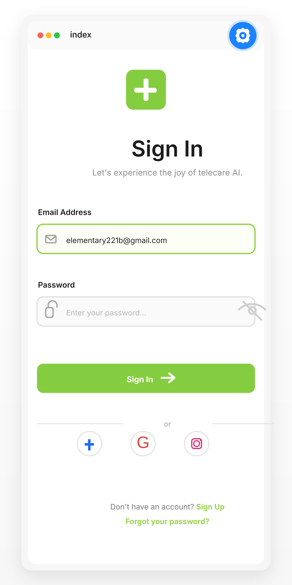

# Sign In — Telecare AI

Clean React Native + Expo sign-in screen built with Expo SDK 55 and only core React Native UI primitives.

## Preview

<div align="center">
	<table>
		<tr>
			<td>
				<div style="border:1px solid #d9d9d9;border-radius:14px;overflow:hidden;background:#ffffff;">
					<div style="display:flex;align-items:center;gap:8px;padding:10px 14px;background:#f5f5f5;border-bottom:1px solid #e8e8e8;">
						<span style="width:10px;height:10px;border-radius:50%;background:#ff5f57;display:inline-block"></span>
						<span style="width:10px;height:10px;border-radius:50%;background:#febc2e;display:inline-block"></span>
						<span style="width:10px;height:10px;border-radius:50%;background:#28c840;display:inline-block"></span>
						<span style="margin-left:auto;color:#777;font-size:12px;">Telecare AI Sign In</span>
					</div>
					<div style="padding:18px 22px;display:flex;justify-content:center;background:linear-gradient(180deg,#ffffff 0%,#fbfbfb 100%);">
						
					</div>
				</div>
			</td>
		</tr>
	</table>
</div>

## Core Components Used

- `View`
- `Text`
- `TextInput`
- `TouchableOpacity`
- `ScrollView`
- `StyleSheet`
- `Dimensions` is not used in the final screen; layout is kept responsive with core flexbox spacing
- Material Community Icons from `@expo/vector-icons`

## Features Implemented

- Logo section with green badge and plus symbol
- Heading and subheading
- Email input with icon and focus state
- Password input with lock icon and show/hide toggle
- Sign In button with shadow and active feedback
- Social login buttons for Facebook, Google, and Instagram
- Footer actions for Sign Up and Forgot Password
- Responsive spacing for mobile screens

## Key Design Details

- Primary green: `#7FCA3F`
- Clean white background with soft gray borders
- Clear typography hierarchy with strong heading and lighter body text
- Rounded corners and balanced padding
- Accessible touch targets for buttons and social actions

## Versions

- Expo SDK: 55
- React Native: 0.83.6
- React: 19.2.0
- TypeScript: 5.9.2

## Run

```bash
npm install --legacy-peer-deps
npm start
```

## Screenshot

The screenshot is attached above in the preview frame and also stored in `assets/images/sign-in-preview.svg`.
